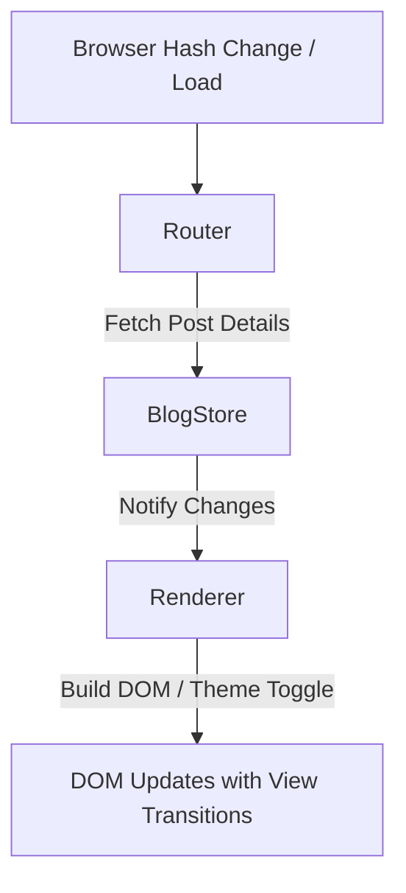

# Frontend SPA Architecture

Alessandro's Blog is built as a modular client-side Single Page Application (SPA). To maintain high performance and avoid framework bloat, it uses vanilla JavaScript modules organized into a clean Model-View-Controller (MVC) pattern.

## Core Architecture Components

The application state and presentation flow are driven by three modules located in `/assets/js/`:

### 1. The Model: `store.js` (`BlogStore`)
- **Responsibility**: Manages the local cache of posts, filters (active tags), and state updates.
- **State Properties**:
  - `posts`: Full list of blog posts metadata.
  - `selectedTags`: Set containing the currently active filter tags.
- **Features**:
  - Fetches the static index `api/index.json` on startup.
  - Manages tag selection/deselection.
  - Emits change events using a callback queue (`onChange`).

### 2. The View: `renderer.js` (`Renderer`)
- **Responsibility**: Coordinates DOM mutations, handles color themes, and parses inline post content.
- **Theme Caching**:
  - Automatically loads and toggles between light and dark modes.
  - Persists preference locally in `localStorage` using key `theme`.
- **Render Targets**:
  - Homepage grid displaying filtered list items.
  - Active tag popover filter list with tag search.
  - Post detail view (fetches lazy-loaded `/api/posts/{slug}.json`).

### 3. The Controller/Router: `router.js` (`Router`)
- **Responsibility**: Monitors browser location hashes and navigates transitions.
- **Hash Schema**:
  - Homepage: `/` or empty hash.
  - Privacy page: `#privacy`.
  - Individual Post: `#post/{slug}`.
- **View Transitions**:
  - Intercepts hash changes.
  - Leverages the modern browser native `document.startViewTransition` API if supported, enabling fluid DOM morph animations during page navigation. Falls back to immediate rendering when not supported.

## Workflow Overview

## Relevant Files
- [main.js](file:///Users/alessandro/Library/Mobile%20Documents/iCloud~AsheKube~Carnets/Documents/Projects/Blog/Website/assets/js/main.js) (Entry point wireframe)
- [store.js](file:///Users/alessandro/Library/Mobile%20Documents/iCloud~AsheKube~Carnets/Documents/Projects/Blog/Website/assets/js/store.js)
- [renderer.js](file:///Users/alessandro/Library/Mobile%20Documents/iCloud~AsheKube~Carnets/Documents/Projects/Blog/Website/assets/js/renderer.js)
- [router.js](file:///Users/alessandro/Library/Mobile%20Documents/iCloud~AsheKube~Carnets/Documents/Projects/Blog/Website/assets/js/router.js)
