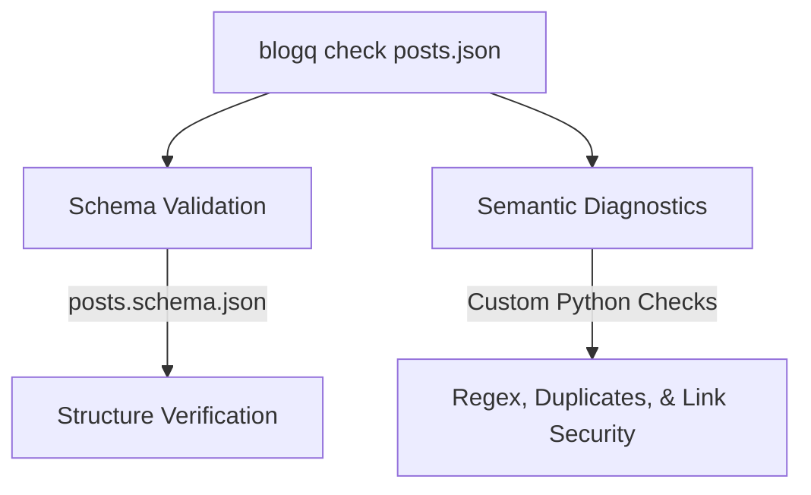

# blogq (Blog Post Validator)

`blogq` is a custom Python-based CLI quality-control tool built to validate the schema structure and semantic rules of `posts.json` prior to commits.

## Architecture & Integration

`blogq` is structured as an installable Python package located in `/tools/blogq/` containing two validation layers:



---

## 1. Schema Validation Layer (`validate.py`)
`blogq` uses `jsonschema` to validate the structural integrity of the post database against `schema/posts.schema.json`.

**Enforced Schema Constraints**:
- **Type**: Must be a JSON object with a root array named `posts`.
- **Required Fields**: Every post entry must contain `title`, `slug`, `publishedAt`, `summary`, `tags`, and `content`.
- **String Formats**:
  - `slug`: Checked against `^[a-z0-9]+(?:-[a-z0-9]+)*$`.
  - `publishedAt`: Validated against ISO 8601 `date-time` format.
- **Constraints**:
  - `summary`: Maximum length of 600 characters.
  - `tags`: Minimum of 1 tag, no duplicates within the list, and minimum string lengths of 1.

---

## 2. Semantic Diagnostics Layer (`checks/semantic.py`)
In addition to JSON Schema parsing, `blogq` performs deep semantic logic checks written in Python:

- **Strict Slug Policy**: Re-verifies slug string regex. If a slug contains double-hyphens, uppercase, or invalid characters, it flags a blocking `ERROR`.
- **Database Uniqueness**: Tracks slug names during file iteration. If a slug matches a previously parsed entry, it flags a duplicate `ERROR` and prints both conflicting indexes.
- **Link Security Enforcement**: Evaluates the post's HTML contents. Any link tag including `target="_blank"` **must** contain `rel="noopener"` (or `noopener noreferrer`) to protect against reverse tabnabbing vulnerabilities. Failing this raises a blocking `ERROR`.
- **Tag Formatting Quality**: Emits warnings (`WARN`) if any tag elements contain leading or trailing whitespaces (e.g. `" AI "` instead of `"AI"`).

---

## Installation & CLI Usage

Install the package in editable mode within a python virtual environment:

```bash
# Set up venv
python3 -m venv .venv
source .venv/bin/activate

# Install blogq
cd tools/blogq
pip install -e .
```

### Commands:
```bash
# Perform validations on posts.json
blogq check posts.json
```

## Relevant Files
- [posts.schema.json](file:///Users/alessandro/Library/Mobile%20Documents/iCloud~AsheKube~Carnets/Documents/Projects/Blog/Website/tools/blogq/src/blogq/schema/posts.schema.json)
- [validate.py](file:///Users/alessandro/Library/Mobile%20Documents/iCloud~AsheKube~Carnets/Documents/Projects/Blog/Website/tools/blogq/src/blogq/validate.py)
- [semantic.py](file:///Users/alessandro/Library/Mobile%20Documents/iCloud~AsheKube~Carnets/Documents/Projects/Blog/Website/tools/blogq/src/blogq/checks/semantic.py)
