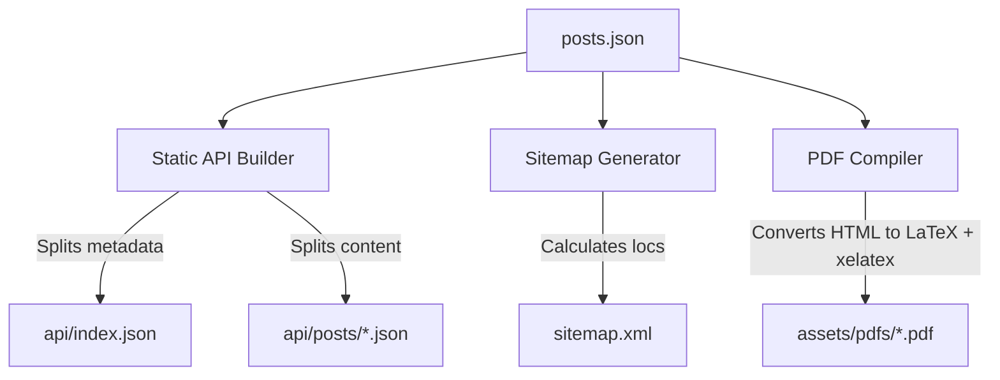

# Build Pipelines

Alessandro's Blog leverages build-free runtime delivery but automates serverless pipeline utilities for API partitioning, search engine optimization (SEO), and premium typesetting.

## Pipeline Architecture Overview



---

## 1. Static API Builder (`build-static-api.js`)
- **Location**: `scripts/build-static-api.js`
- **Purpose**: Creates static JSON endpoints to avoid shipping the entire database (`posts.json`) to the browser on load.
- **Workflow**:
  1. Reads `posts.json` and parses JSON.
  2. Compiles metadata array (`title`, `slug`, `publishedAt`, `summary`, `tags`, `source`, `contributor`) and writes it to `api/index.json`.
  3. Iterates over posts and writes each complete post dictionary to `api/posts/{slug}.json`.
- **Command**:
  ```bash
  node scripts/build-static-api.js
  ```

---

## 2. Sitemap Generator (`generate-sitemap.js`)
- **Location**: `tools/generate-sitemap.js`
- **Purpose**: Dynamically computes indexing endpoints.
- **Workflow**:
  - Checks if a static pre-rendered version of the post exists at `posts/{slug}.html`.
  - If a static HTML file exists, adds `<loc>https://alessandrosblog.it.eu.org/posts/{slug}.html</loc>`.
  - Otherwise, falls back to the SPA dynamic hash URL `<loc>https://alessandrosblog.it.eu.org/#post/{slug}</loc>`.
  - Standard compliant: Google ignores `<priority>` and `<changefreq>`, so these tags are skipped.
- **Command**:
  ```bash
  node tools/generate-sitemap.js [--dry-run]
  ```

---

## 3. PDF Compiler (`build-pdfs.mjs`)
- **Location**: `scripts/build-pdfs.mjs`
- **Purpose**: Transpiles HTML blog posts into professionally typeset PDFs utilizing `pandoc` and `xelatex`.
- **Workflow**:
  1. Loops through sorted posts in `posts.json`.
  2. If `assets/pdfs/{slug}.pdf` already exists, it is skipped.
  3. Sanitizes content: removes `<p>read more here...</p>` tag structures, escapes LaTeX reserved characters.
  4. Calls `pandoc` shell process to convert filtered HTML body into LaTeX blocks (`pandoc -f html -t latex`).
  5. Wraps output in a custom Memoir Document template (which defines fonts like Pagella and Inconsolata, margins, ESO-Pic logo overlays).
  6. Spawns `xelatex` compiler on a temporary copy, verifying a PDF was generated.
  7. Copies finalized output to `assets/pdfs/{slug}.pdf`.
- **Dependencies**: Requires `pandoc` and TeX Live / MacTeX (`xelatex`) installed on the host system.
- **Command**:
  ```bash
  node scripts/build-pdfs.mjs
  ```

## Relevant Files
- [build-static-api.js](file:///Users/alessandro/Library/Mobile%20Documents/iCloud~AsheKube~Carnets/Documents/Projects/Blog/Website/scripts/build-static-api.js)
- [generate-sitemap.js](file:///Users/alessandro/Library/Mobile%20Documents/iCloud~AsheKube~Carnets/Documents/Projects/Blog/Website/tools/generate-sitemap.js)
- [build-pdfs.mjs](file:///Users/alessandro/Library/Mobile%20Documents/iCloud~AsheKube~Carnets/Documents/Projects/Blog/Website/scripts/build-pdfs.mjs)
