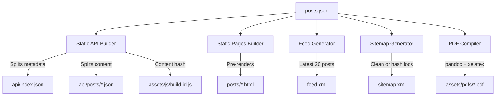

# Build Pipelines

Alessandro's Blog serves content as static files. Small Node utilities partition the API, pre-render SEO HTML, emit the Atom feed and sitemap, and (optionally) typeset PDFs.

## Pipeline Architecture Overview


```mermaid
graph TD
    A[posts.json] --> B[Static API Builder]
    A --> C[Static Pages Builder]
    A --> D[Feed Generator]
    A --> E[Sitemap Generator]
    A --> F[PDF Compiler]
    
    B -->|Splits metadata| G[api/index.json]
    B -->|Splits content| H[api/posts/*.json]
    B -->|Content hash| I[assets/js/build-id.js]
    
    C -->|Pre-renders| J[posts/*.html]
    
    D -->|Latest 20 posts| K[feed.xml]
    
    E -->|Clean or hash locs| L[sitemap.xml]
    
    F -->|pandoc + xelatex| M[assets/pdfs/*.pdf]
```

---

## 1. Static API Builder (`build-static-api.js`)
- **Location**: `scripts/build-static-api.js`
- **Purpose**: Creates static JSON endpoints so the browser does not download all of `posts.json` on load. Also writes a **BUILD_ID** for cache busting.
- **Workflow**:
  1. Reads `posts.json` and parses JSON.
  2. Compiles metadata array (`title`, `slug`, `publishedAt`, `summary`, `tags`, `source`, `contributor`) and writes it to `api/index.json`.
  3. Iterates over posts and writes each complete post dictionary to `api/posts/{slug}.json`.
  4. Hashes `posts.json` (SHA-256, first 12 hex chars) into `assets/js/build-id.js` as `export const BUILD_ID = "..."`.
- **Client use**: `store.js` and `renderer.js` append `?v=${BUILD_ID}` to API (and static HTML fallback) fetches so publishes invalidate browser/CDN caches without `cache: "no-store"`.
- **Command**:
  ```bash
  node scripts/build-static-api.js
  ```

---

## 2. Static Pages Builder (`build-static-pages.js`)
- **Location**: `scripts/build-static-pages.js`
- **Purpose**: Pre-renders a self-contained HTML page per post for crawlers and social unfurlers.
- **Output**: `posts/{slug}.html` with title, description, OG tags, canonical URL, Article JSON-LD, and full body content.
- **Command**:
  ```bash
  node scripts/build-static-pages.js
  ```

---

## 3. Atom Feed Generator (`generate-feed.js`)
- **Location**: `tools/generate-feed.js`
- **Purpose**: Builds `feed.xml` (Atom) for readers and aggregators.
- **Notes**: Prefers full HTML from `api/posts/{slug}.json`; caps at 20 newest entries; links to static post URLs.
- **Command**:
  ```bash
  node tools/generate-feed.js [--dry-run]
  ```

---

## 4. Sitemap Generator (`generate-sitemap.js`)
- **Location**: `tools/generate-sitemap.js`
- **Purpose**: Dynamically computes indexing endpoints.
- **Workflow**:
  - Checks if a static pre-rendered version of the post exists at `posts/{slug}.html`.
  - If a static HTML file exists, adds `<loc>https://alessandrosblog.it.eu.org/posts/{slug}.html</loc>`.
  - Otherwise, falls back to the SPA dynamic hash URL `<loc>https://alessandrosblog.it.eu.org/#post/{slug}</loc>`.
  - Google ignores `<priority>` and `<changefreq>`, so these tags are skipped.
- **Command**:
  ```bash
  node tools/generate-sitemap.js [--dry-run]
  ```

---

## 5. PDF Compiler (`build-pdfs.mjs`)
- **Location**: `scripts/build-pdfs.mjs`
- **Purpose**: Transpiles HTML blog posts into professionally typeset PDFs utilizing `pandoc` and `xelatex`.
- **Workflow**:
  1. Loops through sorted posts in `posts.json`.
  2. If `assets/pdfs/{slug}.pdf` already exists, it is skipped (incremental: only generates missing PDFs).
  3. Sanitizes content: removes `<p>read more here...</p>` tag structures, escapes LaTeX reserved characters.
  4. Calls `pandoc` shell process to convert filtered HTML body into LaTeX blocks (`pandoc -f html -t latex`).
  5. Wraps output in a custom Memoir Document template (which defines fonts like Pagella and Inconsolata, margins, ESO-Pic logo overlays).
  6. Spawns `xelatex` compiler on a temporary copy, verifying a PDF was generated.
  7. Copies finalized output to `assets/pdfs/{slug}.pdf`.
- **Dependencies**: Requires `pandoc` and TeX Live / MacTeX (`xelatex`) installed on the host system.
- **Command**:
  ```bash
  node scripts/build-pdfs.mjs
  ```
- **CI**: PDFs are **not** built in GitHub Actions (TeX Live is too heavy). Generate them locally when needed.

---

## Running the Full Pipeline

After compiling new posts with `compile-contrib-posts.js`, run these steps (or rely on CI for everything except PDFs):

```bash
# 1. Generate split API JSON files + BUILD_ID (required for lazy loading / cache bust)
node scripts/build-static-api.js

# 2. Build PDFs for any new posts (local only; requires pandoc & xelatex)
node scripts/build-pdfs.mjs

# 3. Generate static HTML pages (for SEO indexing and social cards)
node scripts/build-static-pages.js

# 4. Generate the Atom feed (feed.xml)
node tools/generate-feed.js

# 5. Generate the sitemap (must be run AFTER build-static-pages.js so it detects the HTML files)
node tools/generate-sitemap.js
```

**Order Matters:**
- `build-static-api.js` should run before feed generation because `generate-feed.js` embeds content from `api/posts/{slug}.json`.
- `build-static-pages.js` should run before `generate-sitemap.js` because the sitemap prefers `posts/{slug}.html` when present.

---

## CI: Publish Artifacts

`.github/workflows/publish.yml` runs on push to `main` (and `workflow_dispatch`):

1. `blogq check posts.json`
2. `pytest` for blogq
3. `build-static-api.js` → `build-static-pages.js` → `generate-feed.js` → `generate-sitemap.js`
4. Commits dirty artifacts with message `chore: regenerate static artifacts [skip ci]`

The `[skip ci]` token prevents an infinite regenerate loop.

> [!IMPORTANT]
> Skipping the PDF build step will leave newly published posts without a downloadable PDF artifact. Run `node scripts/build-pdfs.mjs` locally when you care about PDFs.

---

## Relevant Files
- [build-static-api.js](../../../scripts/build-static-api.js)
- [build-static-pages.js](../../../scripts/build-static-pages.js)
- [generate-feed.js](../../../tools/generate-feed.js)
- [generate-sitemap.js](../../../tools/generate-sitemap.js)
- [build-pdfs.mjs](../../../scripts/build-pdfs.mjs)
- [publish.yml](../../../.github/workflows/publish.yml)
- [Static Generators](../components/static_generators.md)
